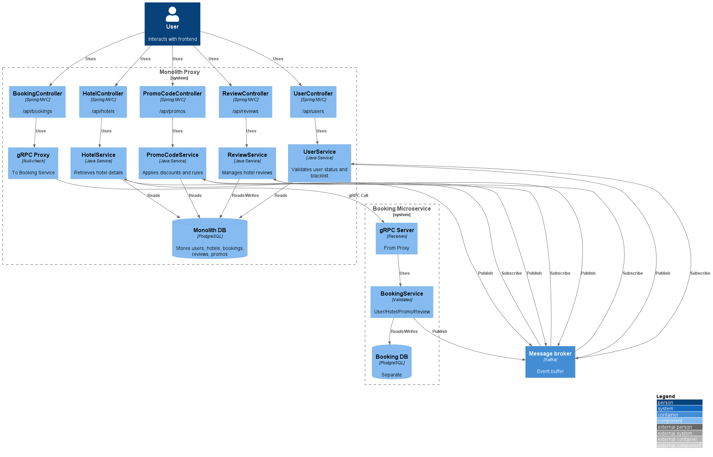

### <a name="_b7urdng99y53"></a>**Название задачи:** Переход от монолита к микросервисам с использованием паттерна Strangler Fig
### <a name="_hjk0fkfyohdk"></a>**Автор:** Швецов Александр
### <a name="_uanumrh8zrui"></a>**Дата:** 13.10.2025
### <a name="_3bfxc9a45514"></a>**Функциональные требования**

| №   | Действующие лица или системы | Use Case                      | Описание                                                                                                                                                                                                                                                                                                                                                                                                                                                       |
| --- | ---------------------------- | ----------------------------- | -------------------------------------------------------------------------------------------------------------------------------------------------------------------------------------------------------------------------------------------------------------------------------------------------------------------------------------------------------------------------------------------------------------------------------------------------------------- |
| 1   | Пользователь                 | Бронирование отеля            | 1. Пользователь отправляет `POST /api/bookings` с `userId`, `hotelId`, `promoCode`. 2. Система валидирует (active/blacklisted от UserService, operational/fully_booked от HotelService, valid/discount/vip_only от PromoCodeService, trusted avg rating >=4.0 от ReviewService). 3. Рассчитывает basePrice (VIP 80.0/100.0 от user status), discount от promo, finalPrice. 4. Сохраняет Booking с discount_percent/price/created_at. 5. Возвращает Booking ID. |
| 2   | Пользователь                 | Поиск отелей                  | 1. Пользователь отправляет `GET /api/hotels/by-city?city=Seoul`. 2. Система query'ит HotelService для фильтра по city. 3. Опционально `top-rated?limit=3` (sort by rating). 4. Возвращает список отелей с `name/city/rating/pricePerNight`.                                                                                                                                                                                                                    |
| 3   | Пользователь                 | Проверка статуса пользователя | 1. Пользователь отправляет `GET /api/users/{userId}/status`. 2. UserService query'ит `app_user` для `status` (ACTIVE/VIP). 3. Возвращает `status`. Аналогично для `blacklisted/active/authorized/vip`.                                                                                                                                                                                                                                                         |
| 4   | Пользователь                 | Валидация промокода           | 1. Пользователь отправляет `GET /api/promos/{code}/valid?isVipUser=true`. 2. PromoCodeService query'ит `promo_code` для `valid/expired/vip_only/discount`. 3. Возвращает `valid` (true/false). `POST /api/promos/validate?code&userId` — с `userId` check.                                                                                                                                                                                                     |
| 5   | Пользователь                 | Проверка отзывов отеля        | 1. Пользователь отправляет `GET /api/reviews/hotel/{hotelId}`. 2. ReviewService query'ит `review` для `hotelId`, возвращает list с `id/user_id/rating/text/created_at`. 3. `GET /api/reviews/hotel/{hotelId}/trusted` — calculate avg rating >=4.0 and count >=10.                                                                                                                                                                                             |

---

### <a name="_u8xz25hbrgql"></a>**Нефункциональные требования**

| №   | Требование                                                                                                                             |
| --- | -------------------------------------------------------------------------------------------------------------------------------------- |
| 1   | Масштабируемость: Система должна масштабироваться по компонентам (e.g. Booking на пиках бронирований), без влияния на User/Hotel.      |
| 2   | Отказоустойчивость: Уровень доступности 99.9%, circuit breaker для calls, fallback proxy в монолите, metrics/tracing на каждый сервис. |
| 3   | CI/CD: Независимая разработка команд, быстрый deploy, тесты (regress.sh 85% OK).                                                       |
| 4   | Производительность: задержка <2 с для уровня, асинхронные события (Kafka) для проверки <5 с, GraphQL BFF для фронта (один запрос).     |
| 5   | Безопасность: безопасность API (JWT), согласованность данных (исходящие для Kafka, SAGA).                                              |


## 🛠️ Подготовка окружения

1. Установите Docker и Docker Compose  
2. Создайте Docker-сеть (если ещё не создана):
   ```bash
   docker network create hotelio-net
   ```
3. Для удобства просмотра кода может понадобиться:
	a. Установите JDK 17  
	b. Установите Gradle (или используйте встроенную в Idea)
	c. Установить Idea или Visual Studio Code 
---

## 🚀 Сборка приложения (при необходимости)
```bash
./gradlew build
```
---

## 🚀 Запуск приложения

```bash
docker-compose up -d --build
```

Поскольку на начальном этапе в базе данных отсутствовали сведения, я обнаружил скрипты в директории test и решил загрузить их для тестирования. Для этого я выполнил следующие команды: 

```bash
docker cp ../test/init-fixtures.sql hotelio-db:/tmp/init.sql
docker exec -i hotelio-db psql -U hotelio -d hotelio -f /tmp/init.sql
```

Также немного переделал скрипт БД добавив проверки:

```sql
DO $$ BEGIN
  DELETE FROM app_user;
EXCEPTION
  WHEN undefined_table THEN
    RAISE NOTICE 'app_user table does not exist, skipping delete';
END $$;
DO $$ BEGIN
  DELETE FROM hotel;
EXCEPTION
  WHEN undefined_table THEN
    RAISE NOTICE 'hotel table does not exist, skipping delete';
END $$;
DO $$ BEGIN
  DELETE FROM review;
EXCEPTION
  WHEN undefined_table THEN
    RAISE NOTICE 'review table does not exist, skipping delete';
END $$;
DO $$ BEGIN
  DELETE FROM promo_code;
EXCEPTION
  WHEN undefined_table THEN
    RAISE NOTICE 'promo_code table does not exist, skipping delete';
END $$;
DO $$ BEGIN
  DELETE FROM booking;
EXCEPTION
  WHEN undefined_table THEN
    RAISE NOTICE 'booking table does not exist, skipping delete';
END $$;
```

Проверка работоспособности:

```bash
curl http://localhost:8084/bookings
curl http://localhost:8084/api/users/test-user-1
curl http://localhost:8084/api/users/test-user-1/active
curl http://localhost:8084/api/users/test-user-1/blacklisted
```

Также при запуске тестов возникли ошибки и в результате добавил sleep 

```shell script
echo "Ожидание готовности БД и API..."
for i in {1..5}; do
  PGPASSWORD="${DB_PASSWORD}" pg_isready -h "${DB_HOST}" -p "${DB_PORT}" -U "${DB_USER}" -d "${DB_NAME}" && break || sleep 30
done
PGPASSWORD="${DB_PASSWORD}" pg_isready -h "${DB_HOST}" -p "${DB_PORT}" -U "${DB_USER}" -d "${DB_NAME}" || { echo "БД 'hotelio' не готова после 150s"; exit 1; }
sleep 30  # Дополнительно для API
```


Тесты показывают, что система частично стабильна, но бронирование (ключевой модуль) уязвимо — идеально для анализа проблем (масштабируемость, связность).

Результаты лотестов находяться в [логи тестов](test-log.txt)
Результаты запросов curl в [curl запросы](result_curl.txt)

---

### <a name="_qmphm5d6rvi3"></a>**Решение**

На начальном этапе будет выноситься BookingService, так как это критичный модул с высокой нагрузкой (пики бронирований). Также у него множество зависимостей (UserService, HotelService, PromoCodeService, ReviewService). Тесты показывают, что в данном сервисе есть ошибки, вероятность ошибок высока.

#### **План миграции**: 
1. Proxy в монолите с gRPC.
2. Новый Booking микросервис с отдельной базой данных (PostgreSQL, flyway), асинхронная валидация через события Kafka (публикация "validate-booking-request", подписка "*-result").
3. Тестирование: базовая версия Regress.sh, интеграция с Testcontainers.
4. Развертывание: флаг функции, разделение Istio 90/10 старый/новый.


### <a name="_bjrr7veeh80c"></a>**Альтернативы**
UserService (низкая нагрузка, меньше тестов), ReviewService (простой, но периферийный)


## **Диаграмма C4**



## **Таблица сравнения вариантов миграции**
| Вариант              | Плюсы                                                      | Минусы                                       | Подходит для Hotelio?            |
| -------------------- | ---------------------------------------------------------- | -------------------------------------------- | -------------------------------- |
| gRPC proxy           | Типобезопасность, performance (binary), null-check в proto | Сложность настройки (protoc)                 | Да, для Booking                  |
| REST proxy           | Простота реализации                                        | Медленнее gRPC, JSON overhead                | Альтернатива, если gRPC излишний |
| Event-driven (Kafka) | Слабая связанность (нет прямых вызовов)                    | Сложно реализовать (нужно время на освоения) | Да, для зависимостей             |
| GraphQL BFF          | Гибкость для фронта, один запрос для booking + user/hotel  | Излишний для начала особенно для backend     | Для будущего (GraphQL gateway)   |
