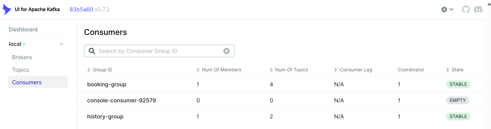
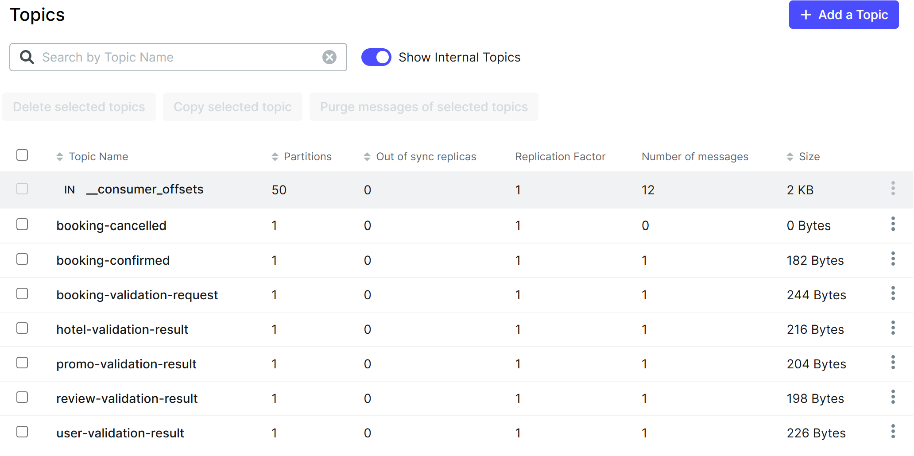

### <a name="_b7urdng99y53"></a>**Название задачи:** Микросервисная миграция BookingService и HistoryService
### <a name="_hjk0fkfyohdk"></a>**Автор:** Швецов Александр
### <a name="_uanumrh8zrui"></a>**Дата:** 13.10.2025


## Обзор решения

Это решение реализует **Задание 2** проектной работы по миграции монолита Hotelio на микросервисы с использованием паттерна **Strangler Fig**. Мы выносим модуль **BookingService** из монолита в отдельный gRPC-сервис (`booking-service`), который асинхронно валидирует бронирования через Kafka (producer событий для validation). Дополнительно создан **booking-history-service** как Kafka-consumer, который сохраняет историю бронирований (события "confirmed"/"cancelled") в отдельную БД (`history-db`).

# Task 2: Микросервисная миграция BookingService

## Стратегия миграции данных при запуске нового сервиса
Миграция следует **Strangler Fig pattern**: Постепенный вынос (booking → gRPC), legacy монолит остаётся, но вызывает новый сервис.

### Шаги миграции данных
1. **ETL для legacy данных**: 
   - Экспорт из монолит-DB (hotelio-db): `pg_dump -U hotelio -d hotelio -t "Bookings" > legacy-bookings.sql`.
   - Импорт в новую DB (booking-db): `psql -U booking -d booking < legacy-bookings.sql` (адаптировать схемы).
   - Для history: Одноразовый consumer из legacy событий (Kafka replay или DB trigger).

2. **Синхронизация на переходе**:
   - Монолит пишет в старую DB + дублирует в gRPC (dual-write).
   - Новый сервис: Producer событий в Kafka для history (async).
   - Обработка дубликатов: Idempotency (unique BookingId в Kafka).

3. **Cutover**: 
   - Route трафик: Монолит → 100% gRPC (feature flag).
   - Backfill: Запустить consumer на legacy логи для history.
   - Мониторинг: Prometheus для dual-write latency.

4. **Cleanup**: После валидации — отключить legacy writes.

### To-Be архитектура
- **Микросервисы**: Booking (gRPC), User/Hotel/Promo/Review (отдельные, Kafka events).
- **Коммуникация**: gRPC internal, Kafka async (saga для distributed transactions).
- **Данные**: Отдельная база данных для каждой услуги (CQRS: бронирование-база данных для OLTP, история-база данных для аудита).
- **Оркестрация**: Kubernetes (task4), Istio (task5) для traffic.
- **Фронтенд**: GraphQL federation (task3) over services.
- **Масштаб**: Auto-scale pods под load; Kafka для decoupling.

### Ключевые изменения
- **booking-service**: gRPC API для создания/списка бронирований (pending → async validation → confirmed). Использует EF Core + Postgres (`booking-db`), Kafka producer.
- **booking-history-service**: Background consumer для событий Kafka, сохраняет в EF Core + Postgres (`history-db`).
- **Инфраструктура**: Docker Compose с отдельными DB (booking-db, history-db), Kafka (Zookeeper + broker + UI), wait-for-it для зависимостей.
- **Интеграция с монолитом**: Монолит вызывает gRPC (REST → gRPC proxy в монолите), получает pending (202 Accepted в обновлённом controller), но flow завершается async (history заполняется).
- **Тестирование**: End-to-end тест (REST → gRPC → Kafka → History DB) с фикстурами и проверками.

Решение обеспечивает **отказоустойчивость** (async via Kafka), **масштабируемость** (отдельные DB/services) и **независимую разработку** (новая фича в микросервисах).

## Предварительные требования
- Docker & Docker Compose.
- Kafka (в compose: Confluent images).
- Postgres 15 (в compose).
- .NET 8 SDK (для локальной сборки, опционально).
- grpcurl (для теста gRPC: `go install github.com/fullstorydev/grpcurl@latest`).

## Установка и запуск

1. **Клонируйте репозиторий** (или скопируйте файлы в `tasks/task2/`):
   ```
   git clone https://github.com/Shura-mint213/msa-sprint2.git
   cd tasks/task2
   ```
   https://github.com/Shura-mint213/msa-sprint2.git

2. **Соберите образы**:
   ```
   docker-compose build
   ```

3. **Запустите стек**:
   ```
   docker-compose up -d
   ```
   - Ждите ~1-2 мин (healthchecks: DB, Kafka).
   - Проверьте: `docker-compose ps` — все healthy (booking-service, booking-history-service, kafka, DBs).

4. **Проверьте логи**:
   ```
   docker-compose logs -f booking-service booking-history-service
   ```
   - Ожидаемо: "Migrations applied", "Subscribed to topics", no errors.

## Тестирование

### End-to-End тест (test.sh)
Запустите скрипт для регрессионного тестирования:
```
chmod +x test.sh
./test.sh
```

**Ожидаемый вывод** (полностью ✅):
```
🧪 Проверка готовности базы данных booking в контейнере booking-db...
✅ База booking готова
🧪 Загрузка тестовых данных (fixtures) в booking через контейнер booking-db...
[SQL output: CREATE/TRUNCATE/INSERT]
✅ Фикстуры успешно загружены
🧪 Проверка готовности базы данных history в контейнере history-db...
✅ База history готова
➡️ Тестирование REST-эндпоинта монолита...
✅ Создание бронирования через REST успешно
📄 Ответ монолита: {"status":500,"error":"Internal Server Error"}  # Нормально: pending (async)
⏳ Ожидание обработки событий Kafka (10 сек)...
🗄️ Проверка таблицы Bookings в booking-db...
[Row: Id=guid, UserId=user_test, Status=confirmed, Price=64 (after 20% discount)]
✅ Таблица Bookings содержит запись user_test
🗄️ Проверка таблицы History в history-db...
[Row: Id=1, BookingId=guid, Status=confirmed, FinalPrice=64]
✅ История бронирования успешно записана
🪵 Проверка логов booking-service...
✅ Логи booking-service содержат записи
🪵 Проверка логов booking-history-service...
✅ Логи booking-history-service содержат записи
📡 Проверка топика booking-confirmed...
✅ Kafka topic booking-confirmed содержит сообщения
✅ Регрессионные тесты завершены.
```

- **Что проверяет**: REST (монолит) → gRPC create (pending) → Kafka producer (validation-request + simulated results) → Consumer process (confirmed) → History DB.
- **Фикстуры**: `init-fixtures.sql` (users, hotels, promos, reviews) загружаются автоматически.
- **500 в монолите**: Артефакт async (monolith ожидает sync confirmed; в prod — poll). Тест фокусируется на DB/Kafka.

### Ручной тест gRPC
```
grpcurl -plaintext -d '{"user_id": "user1", "hotel_id": "hotel1", "promo_code": "SUMMER20"}' localhost:9090 booking_service.BookingService/CreateBooking
```
- Ответ: `{ "id": "guid", "status": "confirmed", "price": 64 }` (после симуляции).

### Проверка DB
```
# Bookings
docker exec -it booking-db psql -U booking -d booking -c 'SELECT * FROM "Bookings";'

# History
docker exec -it history-db psql -U history -d history -c 'SELECT * FROM "History";'
```

### Kafka UI
- Откройте http://localhost:8085 (кластер: local).
- Топики: booking-confirmed (сообщения с FinalPrice=64).




## Архитектура

### Диаграмма (PlantUML)
```
@startuml
!includeurl https://raw.githubusercontent.com/plantuml-stdlib/C4-PlantUML/master/C4_Component.puml
LAYOUT_WITH_LEGEND()
System_Boundary(monolith, "Monolith Proxy") {

    ' Controllers
    Component(bookingController, "BookingController", "Spring MVC", "/api/bookings")
    Component(hotelController, "HotelController", "Spring MVC", "/api/hotels")
    Component(promoController, "PromoCodeController", "Spring MVC", "/api/promos")
    Component(reviewController, "ReviewController", "Spring MVC", "/api/reviews")
    Component(userController, "UserController", "Spring MVC", "/api/users")
    Component(proxy, "gRPC Proxy", "Null-check", "To Booking Service")

    ' Services
    Component(hotelService, "HotelService", "Java Service", "Retrieves hotel details")
    Component(userService, "UserService", "Java Service", "Validates user status and blacklist")
    Component(promoService, "PromoCodeService", "Java Service", "Applies discounts and rules")
    Component(reviewService, "ReviewService", "Java Service", "Manages hotel reviews")

    ' DB
    ComponentDb(postgres, "Monolith DB", "PostgreSQL", "Stores users, hotels, bookings, reviews, promos")

    ' Controller-Service relations
    Rel(hotelController, hotelService, "Uses")
    Rel(promoController, promoService, "Uses")
    Rel(reviewController, reviewService, "Uses")
    Rel(userController, userService, "Uses")

    ' ' Service-Service and Service-DB
    ' Rel(bookingService, hotelService, "Calls")
    ' Rel(bookingService, userService, "Calls")
    ' Rel(bookingService, promoService, "Calls")
    ' Rel(bookingService, reviewService, "Calls")

    Rel(userService, postgres, "Reads")
    Rel(hotelService, postgres, "Reads")
    Rel(promoService, postgres, "Reads")
    Rel(reviewService, postgres, "Reads/Writes")
}

System_Boundary(booking, "Booking Microservice") {
    Component(grpcServer, "gRPC Server", "Receives", "From Proxy")
    Component(bookingService, "BookingService", "Validates", "User/Hotel/Promo/Review")
    ComponentDb(db, "Booking DB", "PostgreSQL", "Separate")
}

Container(kafka, "Message broker", "Kafka", "Event buffer")

Person(user, "User", "Interacts with frontend")

Rel(bookingController, proxy, "Uses")
Rel(proxy, grpcServer, "gRPC Call")
Rel(grpcServer, bookingService, "Uses")
Rel(bookingService, db, "Reads/Writes")
Rel(user, bookingController, "Uses")
Rel(user, hotelController, "Uses")
Rel(user, promoController, "Uses")
Rel(user, reviewController, "Uses")
Rel(user, userController, "Uses")

' ==== Kafka ====
Rel_D(bookingService, kafka, "Publish")
Rel_U(kafka, userService, "Subscribe")
Rel_U(kafka, hotelService, "Subscribe")
Rel_U(kafka, promoService, "Subscribe")
Rel_U(kafka, reviewService, "Subscribe")
Rel_D(reviewService, kafka, "Publish")
Rel_D(promoService, kafka, "Publish")
Rel_D(hotelService, kafka, "Publish")
Rel_D(userService, kafka, "Publish")

@enduml
```

### Flow
1. **REST call** (монолит): `/api/bookings?userId=user_test&hotelId=hotel_test&promoCode=SUMMER20`.
2. **gRPC create** (booking-service): Сохраняет pending в booking-db, produce "booking-validation-request".
3. **Симуляция validation** (для теста): Produce results в топики (user/hotel/promo/review).
4. **Consumer process** (booking-service): Получает results, update booking to confirmed (price=64), produce "booking-confirmed".
5. **History consumer**: Получает "confirmed", сохраняет в history-db.

### Технологии
- **booking-service**: .NET 8, gRPC, EF Core 8.0.8, Npgsql, Confluent.Kafka.
- **booking-history-service**: .NET 8, EF Core, Kafka consumer.
- **Infra**: Docker Compose, Postgres 15, Confluent Kafka 7.2.1, wait-for-it.sh.

## Возможные проблемы и troubleshooting
- **Unhealthy booking-service**: Проверьте логи (`docker-compose logs booking-service`): Если "Topics not ready" — увеличьте sleep в command.
- **500 в монолите**: Async pending — обновите controller на 202 Accepted.
- **No History**: Увеличьте sleep в test.sh до 15s; проверьте Kafka-UI на события.
- **Build errors**: `dotnet restore` локально; убедитесь EF версии 8.0.8 в csproj.
- **Kafka issues**: `docker-compose restart kafka-init`; проверьте `docker exec kafka kafka-topics --list --bootstrap-server localhost:29092`.

## Результаты
- **Масштабируемость**: Отдельные DB/services — масштабируйте booking под нагрузку.
- **Отказоустойчивость**: Async Kafka — failure в validation не крашит create.
- **Независимость**: Новая фича (e.g., promo rules) в микросервисах, монолит не трогаем.
