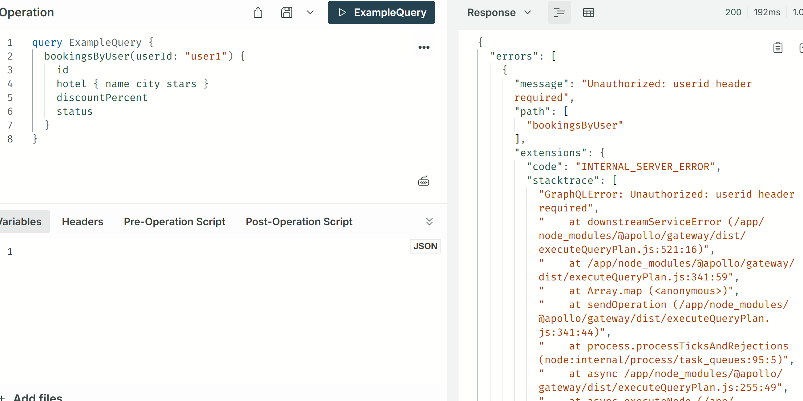
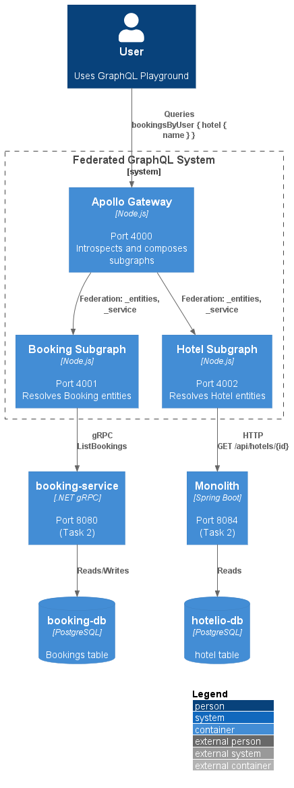
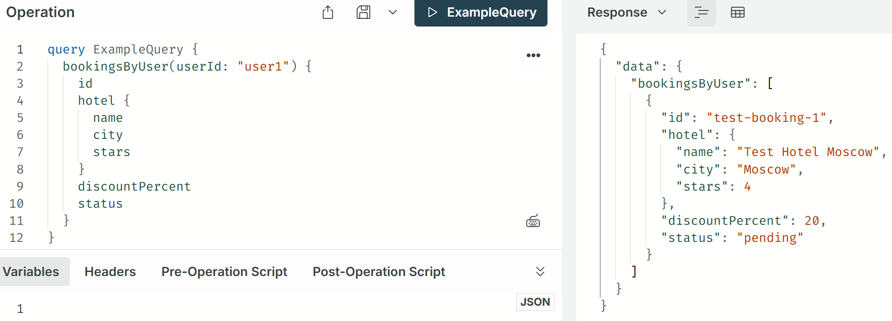

### Task 3: Федеративный GraphQL API

**Автор:** Швецов Александр  
**Дата:** 17.10.2025  

## Обзор
Это решение реализует федеративный GraphQL API над микросервисами из Task 2 с использованием Apollo Federation. Gateway (порт 4000) агрегирует схемы из двух subgraphs:
- **Booking-subgraph** (порт 4001): Вызов gRPC к booking-service (метод `bookingsByUser` с ACL по заголовку `userid`).
- **Hotel-subgraph** (порт 4002): Вызов REST к монолиту (`/api/hotels`), с маппингом полей (`description` → `name`, `rating` → `stars`).

Интеграция: Subgraphs подключены к сети `hotelio-net` из Task 2, с зависимостями от `booking-service` (gRPC) и `monolith` (REST). Заголовки (включая ACL) пробрасываются автоматически. ACL: В resolvers проверяется `req.headers['userid']` — без него или при mismatch бросается "Unauthorized"/"Forbidden".

## Предварительные требования
- Docker и Docker Compose.
- Node.js 18+.
- grpcurl (для теста gRPC: `go install github.com/fullstorydev/grpcurl@latest`).
- Файл `Protos/booking.proto`.

## Установка и запуск
1. **Перейдите в директорию task3**:
   ```
   cd tasks/task3
   ```

2. **Соберите образы**:
   ```
   docker-compose build
   ```

3. **Запустите стек** (включая сервисы из Task 2):
   ```
   docker-compose up -d
   ```
   - Проверьте статус: `docker-compose ps` — все контейнеры Up/healthy.

4. **Проверьте логи**:
   ```
   docker-compose logs -f apollo-gateway booking-subgraph hotel-subgraph
   ```
   - Ожидаемый вывод: "Gateway ready at http://localhost:4000", "Booking subgraph ready at http://localhost:4001", "Hotel subgraph ready at http://localhost:4002".

## Подготовка тестовых данных
Перед тестированием добавьте данные в базы.

### В booking-db (Bookings)
```bash
echo "INSERT INTO \"Bookings\" (\"Id\", \"UserId\", \"HotelId\", \"PromoCode\", \"DiscountPercent\", \"Price\", \"Status\", \"CreatedAt\") VALUES ('test-booking-1', 'user1', 'test-hotel-1', 'SUMMER20', 20, 64.0, 'confirmed', NOW());" | docker exec -i booking-db psql -U booking -d booking
```
- Результат: `INSERT 0 1`.
- Проверка: `docker exec -it booking-db psql -U booking -d booking -c 'SELECT * FROM "Bookings";'`.

### В hotelio-db (hotel)
```bash
echo "INSERT INTO \"hotel\" (\"id\", \"city\", \"description\", \"operational\", \"fully_booked\", \"rating\") VALUES ('test-hotel-1', 'Moscow', 'Test Hotel Moscow', true, false, 4.5);" | docker exec -i hotelio-db psql -U hotelio -d hotelio
```
- Результат: `INSERT 0 1`.
- Проверка: `docker exec -it hotelio-db psql -U hotelio -d hotelio -c 'SELECT * FROM "hotel";'`.

## Тестирование
### GraphQL Playground
- Откройте: [http://localhost:4000](http://localhost:4000).
- **Query** (федерация: booking + hotel):
  ```
  query ExampleQuery {
    bookingsByUser(userId: "user1") {
      id
      hotel { name city stars }
      discountPercent
      status
    }
  }
  ```
- **HTTP Headers** (вкладка слева):
  ```
  {"userid": "user1"}
  ```
- **Ожидаемый ответ**:
  ```
  {
    "data": {
      "bookingsByUser": [
        {
          "id": "test-booking-1",
          "hotel": {
            "name": "Test Hotel Moscow",
            "city": "Moscow",
            "stars": 4
          },
          "discountPercent": 20,
          "status": "confirmed"
        }
      ]
    }
  }
  ```

### Тест ACL (Deny)
- **Query**: Тот же.
- **Headers**: Пустой или `{"userid": "wrong"}`.
- **Ожидаемый ответ**:
  ```
  {
    "errors": [
      {
        "message": "Unauthorized: userid header required"
      }
    ]
  }
  ```
- **Скриншот**: .

### Ручные тесты
- **gRPC в booking-subgraph**:
  ```
  grpcurl -plaintext -d '{"user_id": "user1"}' localhost:9090 booking_service.BookingService/ListBookings
  ```
- **REST в hotel-subgraph**:
  ```
  curl http://localhost:8084/api/hotels/test-hotel-1
  ```

## Описание изменений и решений
### Реализация
- **Gateway (порт 4000)**: Apollo Gateway с IntrospectAndCompose (v2 federation — автоматическое обнаружение схем из subgraphs, без ручного `serviceList`).
- **Booking-subgraph (порт 4001)**: Subgraph для entity Booking (@key: id). Resolver `bookingsByUser` — gRPC-вызов к booking-service (ListBookings). Federation-resolver `hotel` — GraphQL-fetch к hotel-subgraph по `hotelId`. ACL: Проверка `req.headers['userid']` == userId (throw "Unauthorized"/"Forbidden").
- **Hotel-subgraph (порт 4002)**: Subgraph для entity Hotel (@key: id). Resolver `hotelsByIds` — REST-fetch к монолиту (`/api/hotels/{id}`). Маппинг: монолит "description" → schema "name", "rating" → "stars" (fallback 'Unknown'/0 при null).
- **Интеграция с Task 2**: Subgraphs в сети `hotelio-net`, `depends_on` на `booking-service` (gRPC) и `monolith` (REST). Заголовки (ACL) пробрасываются автоматически.

### Решения
- **Federation stitching**: Gateway стичит схемы (Booking ссылается на Hotel по @key). Resolver `hotel` в booking-subgraph вызывает hotel-subgraph для joined данных.
- **ACL**: В resolvers (Query/Booking) — throw Error при отсутствии/mismatch заголовка `userid`. Логи для дебага (console.error/warn).
- **Error handling**: Ошибки gRPC/REST в resolvers (reject/throw). Fallback для null (e.g., hotel null при 404).
- **Прототип**: Заглушки в resolvers (mock status='confirmed' для теста; в prod — full gRPC GetBooking).

### Диаграмма (PlantUML)


## Результаты тестов
### Тест 1: Успешный query с ACL
- **Query**:
  ```
  query ExampleQuery {
    bookingsByUser(userId: "user1") {
      id
      hotel { name city stars }
      discountPercent
      status
    }
  }
  ```
- **Headers**: `{"userid": "user1"}`.
- **Response**:
  ```
  {
    "data": {
      "bookingsByUser": [
        {
          "id": "test-booking-1",
          "hotel": {
            "name": "Test Hotel Moscow",
            "city": "Moscow",
            "stars": 4
          },
          "discountPercent": 20,
          "status": "confirmed"
        }
      ]
    }
  }
  ```
- **Скриншот**: .

### Тест 2: Deny по ACL (скриншот)
- **Query**: Тот же.
- **Headers**: Пустой или `{"userid": "wrong"}`.
- **Response**:
  ```
  {
    "errors": [
      {
        "message": "Unauthorized: userid header required"
      }
    ]
  }
  ```
- **Скриншот**: .

### Тест 3: Без данных (fallback)
- Response: `bookingsByUser: []` (пустой массив, без ошибок).

### Логи запуска
- `docker-compose logs apollo-gateway booking-subgraph hotel-subgraph > results/docker-compose_log_gateway_booking_hotel.txt` ([логи](docker-compose_log_gateway_booking_hotel.txt)).

### Данные в DB (после теста)
- **Bookings (booking-db)**:
  ```
  docker exec -it booking-db psql -U booking -d booking -c 'SELECT * FROM "Bookings";'
  ```
  Вывод:
  ```
           Id       | UserId |   HotelId    | PromoCode | DiscountPercent | Price |  Status   |           CreatedAt           
  ----------------+--------+--------------+-----------+-----------------+-------+-----------+-------------------------------
   test-booking-1 | user1  | test-hotel-1 | SUMMER20  |              20 |    64 | confirmed | 2025-10-17 12:47:24.550579+00
  (1 row)
  ```

- **Hotels (hotelio-db)**:
  ```
  docker exec -it hotelio-db psql -U hotelio -d hotelio -c 'SELECT * FROM "hotel";'
  ```
  Вывод:
  ```
   fully_booked | operational | rating |    description    |  city  |      id
  --------------+-------------+--------+-------------------+--------+--------------
   f            | t           |    4.5 | Test Hotel Moscow | Moscow | test-hotel-1
  (1 row)
  ```

## Структура task3/results/
- `docker-compose.yml` — Полный файл с Task 2 + Task 3.
- `bookingsByUser.png` — Скриншот успешного query.
- `ACL.png` — Скриншот отказа по ACL.
- `data-setup.sql` — INSERT'ы для DB.
- `docker-compose_log_gateway_booking_hotel.txt` — Логи запуска.
- `docker-ps.txt` — Статус контейнеров.